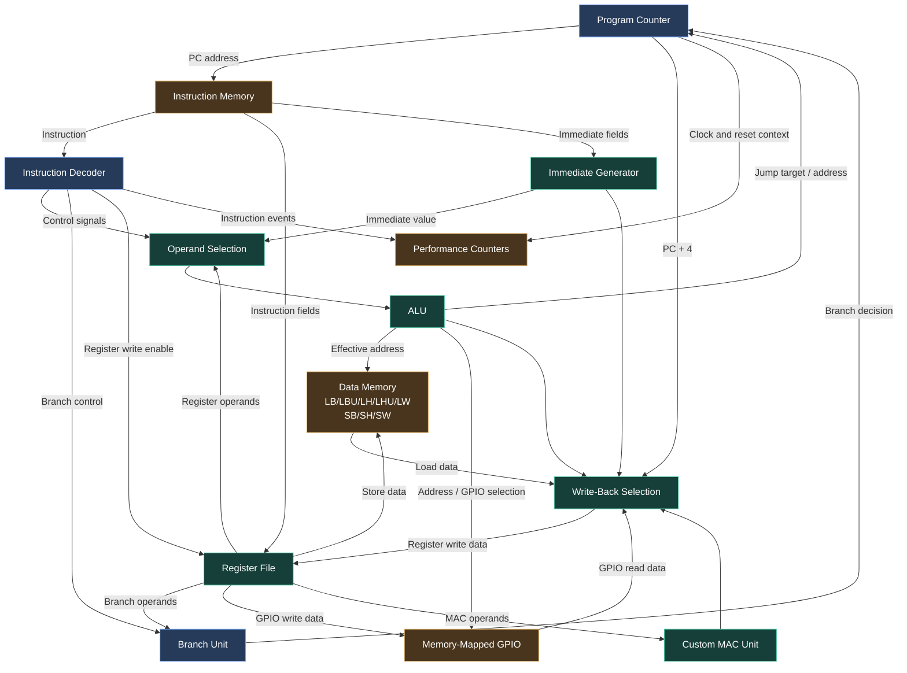

## Architecture

The processor uses a single-cycle datapath with instruction fetch, decode, execution, memory access, and write-back logic.

```mermaid
flowchart TB
    PC["Program Counter"]
    IM["Instruction Memory"]
    DEC["Instruction Decoder"]
    RF["Register File"]
    IMM["Immediate Generator"]
    MUX["Operand Selection"]
    ALU["ALU"]
    BR["Branch Unit"]
    DM["Data Memory<br/>LB/LBU/LH/LHU/LW<br/>SB/SH/SW"]
    GPIO["Memory-Mapped GPIO"]
    MAC["Custom MAC Unit"]
    WB["Write-Back Selection"]
    CSR["Performance Counters"]

    PC -->|PC address| IM
    IM -->|Instruction| DEC
    IM -->|Instruction fields| RF
    IM -->|Immediate fields| IMM

    DEC -->|Control signals| MUX
    RF -->|Register operands| MUX
    IMM -->|Immediate value| MUX
    MUX --> ALU

    RF -->|Branch operands| BR
    DEC -->|Branch control| BR
    BR -->|Branch decision| PC
    ALU -->|Jump target / address| PC

    ALU -->|Effective address| DM
    RF -->|Store data| DM
    ALU -->|Address / GPIO selection| GPIO
    RF -->|GPIO write data| GPIO

    ALU --> WB
    DM -->|Load data| WB
    GPIO -->|GPIO read data| WB
    IMM --> WB
    PC -->|PC + 4| WB
    RF -->|MAC operands| MAC
    MAC --> WB

    WB -->|Register write data| RF
    DEC -->|Register write enable| RF

    DEC -->|Instruction events| CSR
    PC -->|Clock and reset context| CSR

    classDef control fill:#263b59,stroke:#78a9ff,color:#ffffff
    classDef datapath fill:#173f3a,stroke:#55c9a5,color:#ffffff
    classDef memory fill:#49351d,stroke:#e5b566,color:#ffffff

    class PC,DEC,BR control
    class RF,IMM,MUX,ALU,MAC,WB datapath
    class IM,DM,GPIO,CSR memory
```
